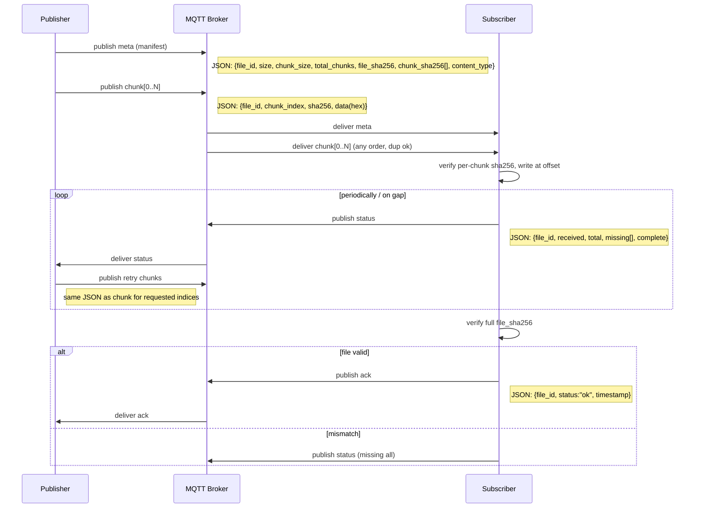

# IoT Simulation (MQTT)

Simple MQTT simulation for IoT: chunked file transfer and basic pub/sub. Works with any MQTT broker.

## Quickstart

1) Install deps
```bash
pip install -r requirements.txt
```

2) Configure broker (optional). Copy example and edit:
```bash
cp .env.example .env.dev
```

3) Run
```bash
# File receiver (writes to .transfer/)
python receive_files.py --storage-dir .transfer

# Send a file (256KB chunks)
python send_file.py ./path/to/file --chunk-size 262144 --qos 1
```

## Topics (file transfer)
`{prefix}/file/{file_id}/meta|chunk|status|retry|ack`

## Security
This demo sends data in plain data (no TLS). Username/password auth controls access but does not encrypt traffic. If broker is on any untrusted network, enable TLS on the broker and client (e.g., MQTT over 8883 with CA/cert/key).

## Fault tolerance covered
| Case | Failure | Detection | Recovery/Behavior |
| --- | --- | --- | --- |
| C1 | Subscriber crash mid-transfer | Missing chunks in state after restart | Subscriber restarts, loads state, requests missing via `status`/`retry` |
| C2 | Publisher crash mid-transfer | Incomplete chunk set | Publisher re-sends; subscriber de-dupes by `chunk_index` and hash |
| C3 | Subscriber offline before transfer | No active subscriber | Publisher continues; subscriber requests on connect (status triggers resend) |
| C4 | Publisher offline before transfer | Idle subscriber | Subscriber periodically emits `status`; resumes when publisher returns |
| C5 | Message lost in transit | Gaps in received indices | Subscriber reports `missing`; publisher re-sends requested chunks |
| C6 | Out-of-order chunk arrival | Non-sequential indices | Positional writes by `chunk_index`; final hash validates integrity |
| C7 | Duplicate chunks (QoS1) | Already in received set | Ignored via index/hash de-dup; idempotent writes |
| C8 | Subscriber crash pre-ACK | No ACK but file complete on disk | ACK sent on next startup after verifying file hash |
| C9 | Publisher crash pre-ACK | Subscriber idle | Subscriber emits `status`; publisher resumes ACK/retry flow |
| C10 | Slow subscriber/burst overload | Buffer growth | Periodic `status` enables pacing; publisher can throttle interval |
| C12 | Network split | Keepalive/reconnect | Auto-reconnect; status-driven retries on reconnection |

## Transfer flow
- Publisher computes manifest (file hash + per-chunk hashes) and publishes to `{prefix}/file/{file_id}/meta`.
- Publisher streams chunks to `{prefix}/file/{file_id}/chunk` with `chunk_index`, `sha256`, and hex data.
- Subscriber writes by position, verifies per-chunk hash, tracks received, and periodically publishes status/missing.
- On completion, subscriber verifies full file hash; if OK, publishes ACK to `{prefix}/file/{file_id}/ack`. Otherwise it requests retries.



